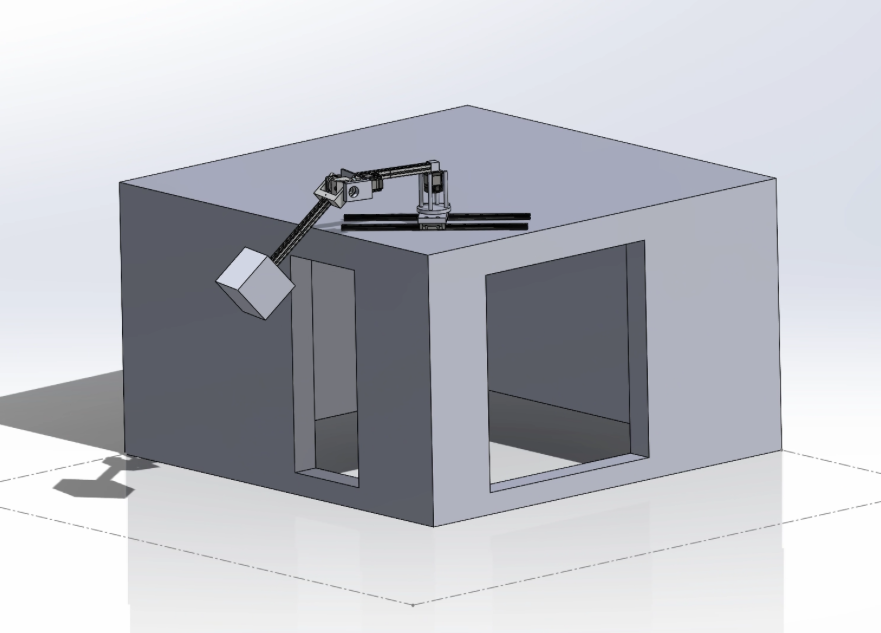
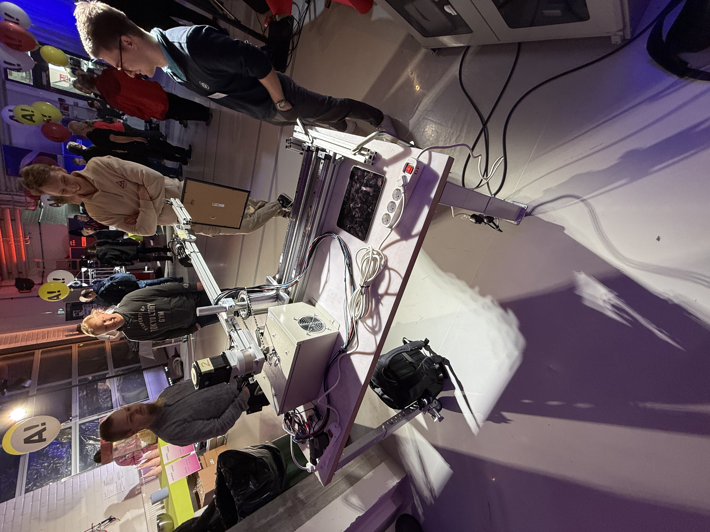

# Manufacturing Documentation

This folder contains all the design files, documentation, and manufacturing specifications for the custom-designed mechanical components of the sunny-robot-arm project. All parts were designed and manufactured in-house to meet the specific requirements of the solar tracking robotic system.

## Contents Overview

### Design Files
- **Original CAD Models**: Fusion 360 (.f3d) or Solidworks (.sldprt) 
- **Exported files** STEP (.step) or STL (.stl)

### Component Categories

#### Core Structural Components
- **Bearing Housing**: Custom housing for rotational axis bearings
- **Base Plate**: Main platform connecting linear rails adn the robot's rotational axis

#### Gearing System
- **Big Gear & Small Gear**: Custom gear set for movement around z-axis

#### Motor Mounting Hardware
- **Motor Attachers**: Direct and bevel gear attachment solutions
- **Profile Fasteners**: Aluminum profile connection hardware
- **Linear Motor Components**: Specialized mounting for linear motion system

#### Sensor & Electronics Housing
- **Sensor Mounts**: Precision positioning for limit switches and sensors
- **Cable Management**: Routing and protection for electrical connections

#### Lamp Assembly
- **LED Lamp Box**: Custom fully 3d printable lamp
- **LED Strip Base**: Mounting platform for LED strips

#### Extras
- **Corner Safeguard**: Little part to avoid hitting metal on metal when switching the power off


## Mechanical Design

The robot has 3 degrees of freedom to move a light source in front of two windows simulating the sun. The robot uses three NEMA34 closed loop stepper motors and is controlled with a RaspberryPi 5. The robot sits on a pair of self-cut 1m long linear rails driven by 1.5m long ball screw enabling the robot to reach both windows. On top of the linear rail is a metal platform and a self-designed housing for two bearings. The bearings compensate the axial and radial torque on the rotating axis of the robot.


### The Robot's Degrees of Freedom:
1. **Linear Rail**: Horizontal translation between windows
2. **Horizontally Rotating Axis**: Base rotation for positioning
3. **Vertically Rotating Arm**: Elevation control for sun angle simulation



### Design and Manufacturing of the Housing for Bearings

The final design for the rotational axis and the housing for bearings was achieved after multiple iterations. The driving factors were available material and manufacturing capabilities at Aalto Design Factory (DF). A suitable material pipe was found from DF which affected the design and sizing for bearings and determined the dimensions for the housing.


We wanted to make assembly and disassembly of the housing as easy as possible and ended up with the final design in which all parts were pushed in place from the top side with no hard to reach screws etc. The assembly consists of two bearings and three lock rings. The CAD assembly section view of the housing visualizes the assembly.


### Linear Assembly

For linear motion, the base plate was designed to connect linear rails, ball screw, and the housing of the bearings. This part was made from a piece of metal found in the basement of the DF, and was CNC'd for our needs. The 3D design includes mounting points for all critical components with precise tolerances for proper alignment.


### Holder Piece for the Motors

Two of the motors were directly mounted to an aluminum profile, so they needed a piece that would attach them. As a bonus from ordering the same motors, we had an advantage of designing one piece that would suit both motors. The part was made from a piece of metal and water cut to our dimensions, ensuring precise fitment and robust mounting.


### Profile Fastening to Bearing Housing

Finally, after designing the parts to attach the motors to the aluminum profile, the profile itself needed to be connected to a bearing housing to complete the construction of the first two degrees of freedom (2-DOFs). A special piece was designed for this purpose—it attaches to the profile using M8 screws and T-nuts.

Attaching the piece to the axle coming out of the housing was a bit trickier. The chosen solution was to machine a hole slightly larger than the axle's diameter and then clamp the piece onto the axle using an additional screw.


### Final Assembly
Final assembly was successful, and "too good" to our surprise. Every piece fit together immediately without the need to adjust or to remake any of them. Additionally, the housing bearing was designed in such a fashion that it compensated all the possible torsions, so the profile could be rotated around the axile with only a pinky, although the total weight of that piece is close to 20kg. 



## Manufacturing Process

### Design Philosophy
- **Modular Design**: All components designed for easy assembly/disassembly
- **Material Optimization**: Designs adapted to available materials at Aalto Design Factory
- **Manufacturing Constraints**: Parts designed within the capabilities of available equipment

### Manufacturing Methods Used
- **CNC Machining**: Precision parts requiring tight tolerances
- **Water Jet Cutting**: Complex profiles and motor mounting plates
- **3D Printing**: Rapid prototyping and non-structural components
- **Manual Machining**: Custom modifications and final fitting

## File Organization

```
Manufacturing/
├── BOM.md                          # Bill of outside the house Materials
├── README.md                       # Documentation
├── Corner safeguard.f3d/.step      # Safety housing components
├── Original idea.f3d/.step         # Initial concept designs
├── Gears/                          # Transmission components
│   ├── Big gear.f3d/.step
│   └── Small gear.f3d/.step
├── Lamp/                           # Light source assembly
│   ├── LED Lamp.f3z
│   ├── LED strip base.f3z
│   └── STEP files/                  # 3D printable components
├── Logos/                          # Branding and identification
├── Motor attachers/                # Motor mounting hardware
├── Pönttö parts/                   # Bearing housing components
├── Random holders/                 # Miscellaneous mounting hardware
├── Screw drive attachers/          # Linear motion components
└── Sensors/                        # Sensor mounting solutions
```

## Technical Specifications

### Materials Used
- **Aluminum Profiles**: Structural framework
- **Steel Plates**: Base plates and motor mounts
- **PLA / PETG Filaments**: 3D printed components
- **Precision Bearings**: High-quality rotational support
