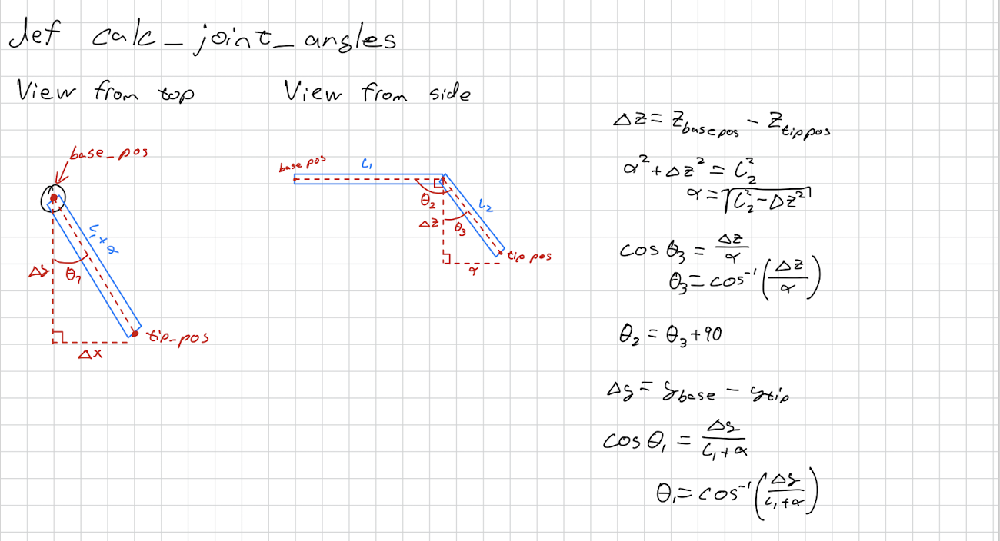

### Explanation of `calc_join_angles` Function

The `calc_join_angles` function calculates the joint angles (`theta1` and `theta2`) for a robotic arm based on the desired position (`pos`). The function assumes that the robotic arm has two segments (`arm1` and `arm2`) and calculates the angles required to reach the given position.

#### Calculations

#### Theta2 Calculation

1. **Calculate the difference in the z-axis (`delta_z`)**:
    ```python
    delta_z = self.base_pos.z - pos.z
    ```

2. **Calculate the horizontal distance ([alpha](http://_vscodecontentref_/0))**:
    ```python
    alpha = np.sqrt(self.arm2_length**2 - delta_z**2)
    ```

3. **Calculate the angle [theta3](http://_vscodecontentref_/1)**:
    ```python
    theta3 = np.arccos(delta_z / self.arm2_length)
    ```

4. **Calculate the angle [theta2](http://_vscodecontentref_/2)**:
    ```python
    theta2 = theta3 + np.deg2rad(90)
    ```

### Theta1 Calculation

1. **Calculate the difference in the y-axis ([delta_y](http://_vscodecontentref_/3))**:
    ```python
    delta_y = self.base_pos.y - pos.y
    ```

2. **Calculate the angle [theta1](http://_vscodecontentref_/4)**:
    ```python
    theta1 = np.arccos(delta_y / (self.arm1_length + alpha))
    ```

#### Return Value

The function returns a tuple containing the calculated angles ([theta1](http://_vscodecontentref_/5) and [theta2](http://_vscodecontentref_/6)):
```python
return (theta1, theta2)
```

#### Description on paper


